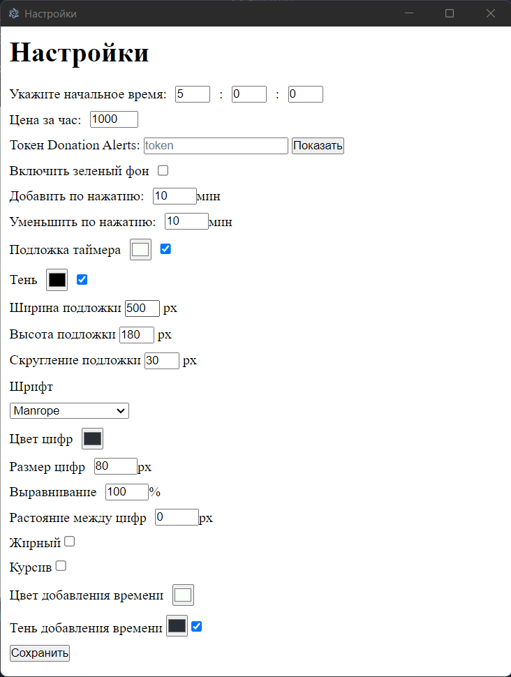

<h1 align="center">Счетчик для донатофона</h1>

 

## Описание
Таймер который увеличивается, когда кто-то жертвует вам деньги на ваш DonationAlerts.  
Работает только с DonationAlerts.

## Предпросмотр
<h3 align="center"></h3>
 

## Использование
Для открытия настроек используйте сочетание клавиш «Ctrl+E».  
Внесите изменения и нажмите сохранить, окно автоматически закроется, а таймер обновится.

Если хотите перезагрузить окно, остановите таймер и закройте окно. При повторном запуске, таймер продолжит с того же места.

## DonationAlerts

### Внимание: Не показывайте свой токен на трансляции!

Чтобы получить токен, вам придется перейти на вкладку общих настроек вашего <a href="https://www.donationalerts.com/dashboard/general-settings/account">DonationAlerts</a> затем нажмите «Показать токен» и скопируйте код.

Вставьте его в настройка в поле «токен DonationAlerts».

### Добавление в OBS
Чтобы добавить его в OBS, вам просто нужно запустить приложение и добавить его как источник захвата окна.

### Как сделать прозрачный фон в OBS

1. Убедитесь, что вы установили `isGreenBackground` в настройках.
2. Выберите вкладку «Фильтры» для источника окна таймера.

3. Добавить фильтр «Хромакей».

<h2>Горячие клавишы</h2>

- Ctrl+E - Открыть настройки
- Arrow UP - Добавить время
- Arrow DOWN - Отнять время
- Space - Остановить таймер
